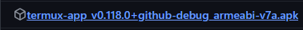

# Server NodeJS - Mobile setup

## 0. Prerequisites
**Android Phone** ( **Android 11 or higher**, as per the tests. ) <br />
Install app "**Termux**" [Only here](https://github.com/termux/termux-app/releases) <br />
Try installing both and then test which of the **APKs** works :

   <br />
   

# Open Termux


## 1. Install Packages
**Step 1 :**  respond with "Y" for all queries.
```bash
pkg update -y
```
**Step 2 :**
```bash
pkg upgrade -y
```

**Step 3 :** respond with "**Y**" for all queries.
```bash
pkg install nodejs -y
```

**Step 4 :** *Verification*
```bash
node -v
```
**result :**
```
vXX.XX.X
```

### Now you are ready to start your server with NodeJS

**Step 1 :**
- Now put your files/folders in the Download folder on your phone, with the help of a file manager found on the Play Store (e.g., File Manager, ZArchiver).

**Step 2 :**
- Go to Termux and type:
```bash
termux-setup-storage
```

### **Now Restart Termux completely** <br />

**Step 3 :**
- Go to **Termux** and type:
```bash
cd /storage/shared/Download
```

**Step 4 :**
```bash
cd <Your files>
```

and **finish** !
you can use **NodeJS** with your project (Discord bots and more)